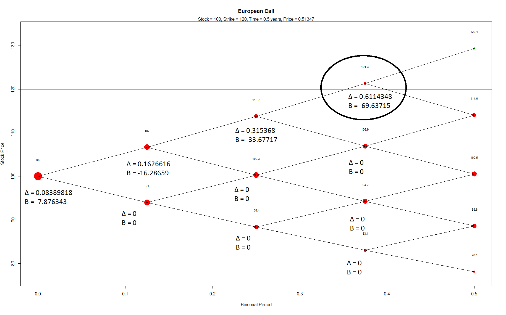
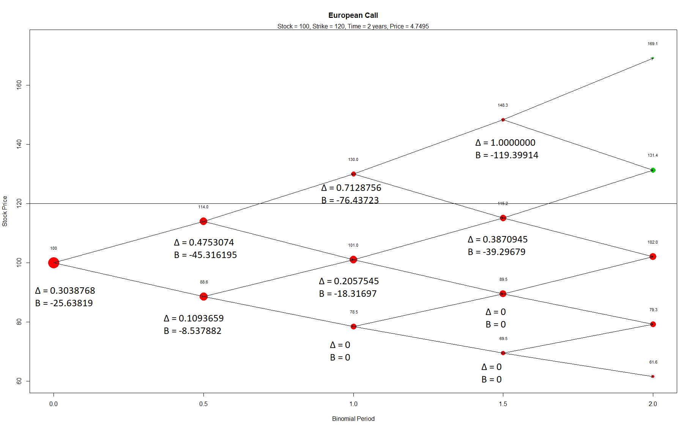
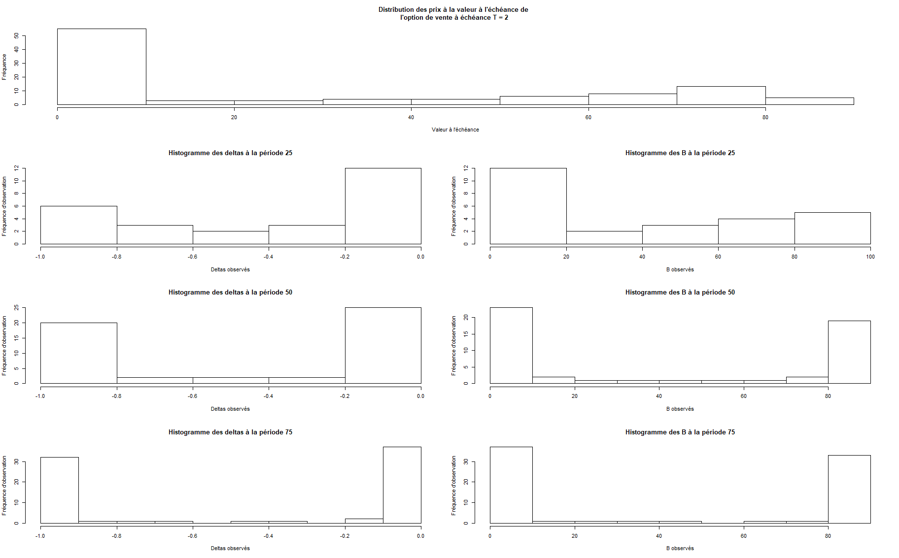
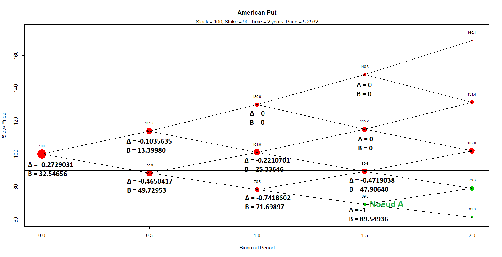

\newpage
\begin{titlingpage}
  \centering
  \Large
  Travail fait par \\
  \vspace{0.5cm}
  \text{Samuel Provencher (111 181 794)}\\
  \text{Matis Brassard-Verrier (111 182 740)}\\
  \text{Olivier Belhumeur (111 184 389)}\\
  \vfill
  \Large
  Gestion du risque financier II \\
  \vspace{0.5cm}
  \text{ACT-2011}
  \vfill
  \Large
  Travail pratique : Équipe 21\\
  \vfill
  \Large
  Présenté à\\
  \vspace{0.5cm}
  \text{Thomas Landry}
  \vfill
  \Large
  École d'actuariat\\
  \text{Université Laval}\\
  \text{29 avril 2019}
\end{titlingpage}


```{r, echo=FALSE}
library(derivmkts)
#setwd("C:/Users/matis/Desktop/ACT-2011 GRF 2/Actuariat/TP_GRF2")
setwd("C:/Users/Matis/Desktop/Actuariat/TP_GRFII")
#setwd("C:/Users/Olivier/Desktop/Développement/Actuariat/2019/Session_H19/GRFII/TP_GRFII")
```
# Question 1
```{r, echo=FALSE, warning=FALSE}
## 1 ####
data <- as.numeric(unlist(read.csv2("Data.csv", sep = ";"))) ## équipe 21
##Estime volatilité
ContReturn <- numeric(length(data)-1) ## 1 de moins
for(i in seq(length(data)-1))
    {
                    ContReturn[i] <- log(data[i+1]/data[i])
}
sd <- sd(ContReturn)*sqrt(12) ##Annuelle
##Estime rf
Rfree <- read.csv("lookup-2.csv", skip = 11)[,2]/100
Rfree_est <- log(1+mean(Rfree))
t <- c(0.5, 2)
```

Pour déterminer l'arbre binomial à terme (forward), il est nécessaire d'obtenir la valeur de la volatilité du sous-jacent ($\hat{\sigma}$), la force d'interêt sans risque $r$, le taux de dividende $\delta$, ainsi que la longueur de la période $h$. Pour simplifier les calculs, le taux de dividende sera supposé nul. 

Le prix à terme à $t$ pour la livraison du sous-jacent au temps $t+h$ est le suivant:

$$
F_{t,t+h} = S_te^{(r-\delta)h} = S_te^{rh}
$$

Les paramètres de la branche supérieure sont définis comme suit:
$$
uS_t = F_{t,t+h}e^{\sigma\sqrt{h}}
$$
Les paramètres de la branche inférieure sont définis comme suit:
$$
dS_t = F_{t,t+h}e^{-\sigma\sqrt{h}}
$$
Ainsi, il est nécessaire d'approximer les paramètres de volatilité et de taux de rendement sans risque. À l'aide des données mensuelles historiques retrouvées dans le chiffrier excel (équipe 21), il est possible de déterminer la volatilité historique du sous-jacent. 

Tout d'abord, l'équation suivante est employée pour déterminer les rendements logarithmiques pour chaque période de $h=\frac{1}{12}$ d'année.

$$
r_{t,t+h} = ln\left(\frac{S_{t+h}}{S_t}\right) \qquad (1)
$$

Ensuite, l'utilisation de (1) est utilisée dans l'équation ci-dessous pour déterminer l'écart-type annuel des données mensuelles historiques. Dans cette équation, il y a une division par $\sqrt{h}$ afin de s'assurer que la volatilité calculée soit sur base annuelle.

$$
\frac{Stdev(ln(r_{t,t+h}))}{\sqrt{h}} = \hat\sigma 
$$


En utilisant les taux de rendement historiques sur les bons du trésor 1 an du Canada, nous avons déterminé les taux de rendement effectif annuel des 5 dernières années. Ces données sont disponibles pour chaque mois sur le site de la Banque du Canada. La formule suivante a été utilisée pour estimer la force d'interêt sans risque annuelle. 

$$
r_f = ln\left(1 + \sum_{i=0}^{n-1}\frac{r_{f,i}}{n}\right)
$$
Où, $n=60$ et $r_{f,i}$ est le taux de rendement effectif annuel pour un bon du trésor 1 an pour le mois $i$.

Les valeurs des paramètres qui seront utilisés pour l'évaluation de différentes options à l'aide du modèle binomial et *Black-Scholes* sont présentées dans le tableau ci-dessous.

| Paramètres | Symboles | Valeurs |
|:----------|:--------:|:---------:|
|   Volatilité        |     $\hat{\sigma}$     |   `r sd*100`%     |
| Force d'interêt sans risque     |     $r$     |     `r Rfree_est*100`%    |
| Taux de dividendes  |     $\delta$     |   0     |


\newpage

# Question 2

Il était demandé de construire des arbres binomiaux d'échéance 6 mois et 2 ans avec 4 et 100 périodes, donc nous devrons construire 4 arbres au total. Nous devions utiliser ces arbres dans le but de faire ressortir plusieurs caractéristiques d'option de vente ($K=90$) et d'option d'achat ($K=120$).

À l'aide des formules développées à la question 1, il est possible de dériver les paramètres $u$ et $d$, représentant le facteur de hausse et de diminution du sous-jacent pendant la période de longueur $h$.

$$
u = e^{rh+\sigma\sqrt{h}} \quad \text{et} \quad d = e^{rh-\sigma\sqrt{h}}
$$
La probabilité d'un mouvement de prix du sous-jacent vers la branche supérieure est la suivante :
$$
p^{*}=\frac{e^{rh}-d}{u-d}
$$
Également, un autre point intéressant de l'évaluation d'option dans le modèle binomial est qu'il est possible de répliquer l'option à chaque noeud de l'arbre. Cela se quantifie avec deux paramètres : $\Delta$ et $B$. Le paramètre $\Delta$ indique la quantité d'actions à acheter/vendre et le paramètre $B$ indique le montant à emprunter/prêter. Il est à noter que ce modèle suppose qu'il est possible d'acheter des fractions d'actions.
$$
\Delta=\frac{\theta_u-\theta_d}{S(u-d)} \qquad (2)
$$

$$
B=e^{-rh}\frac{u*\theta_d - d*\theta_u}{u-d}  \qquad (3)
$$
Ces formules sont dérivées en isolant les deux inconnues dans les deux équations suivantes:

$$
\theta_u = \Delta\times U + B \times e^{-rt}
$$
$$
\theta_d = \Delta\times D + B \times e^{-rt}
$$
où U et D représentent respectivement $S\times u$ et $S\times d$.

Pour la mesure $\Delta$, $\theta_u$ représente la valeur à l'échance de l'option pour le prochain embranchement supérieur, tandis que $\theta_d$ repésente la valeur à l'échéance de l'option pour le prochain embranchement inférieur. Au dénominateur se retrouve la différence entre les paramètres de l'embrachement supérieur et l'embranchement inférieur que peut prendre le sous-jacent lors de la prochaine période. C'est donc un ratio entre les différentes valeurs à l'échéance de l'option par rapport à l'écart du sous-jacent selon l'embranchement. Donc, pour chaque variation de 1 de la valeur du sous-jacent, il y aurait une variation de $\Delta$ de la valeur de l'option.

Quant au montant à emprunter ou à prêter, il représente le gain ou le montant à emprunter pour pouvoir avoir une position longue ou courte dans un option donnée.

Il est observé que pour un propriétaire d'une option d'achat, le $\Delta$ sera toujours $\geq$ 0 et le B sera toujours $\leq$ 0, tandis que pour un propriétaire d'une option de vendre, le $\Delta$ sera toujours $\leq$ 0 et le B sera toujours $\geq$ 0.

Une fois ces paramètres déterminés, on peut répliquer la valeur à l'échéance de l'option en achetant ou en vendant une partie du sous-jacent correspondant au $\Delta$ et en empruntant ou en prêtant B:

$$
\theta = \Delta\times S + B = e^{-rh}(p^*\theta_u+(1-p^*)\theta_d)
$$
Où $\theta$ est la valeur de l'option à un noeud quelconque.

Pour démontrer la valeur de nos paramètres réplicatifs pour une option d'achat, un exemple de calcul sera effectué pour l'option d'achat à l'embranchement supérieur de la troisième période.

L'équation (2) sera utilisée pour déterminer le $\Delta_{uuu}$. $\theta$ sera remplacé par $C$ pour représenter un option d'achat (Call).

$$
\Delta=\frac{C_u-C_d}{S(u-d)}
$$
$$
C_u = max(U - K; 0)
$$
$$
C_u = max(129.4 - 120; 0)
$$

$$
C_u = 9.4
$$
$$
C_d = max(D - K; 0)
$$

$$
C_d = max(114 - 120; 0)
$$

$$
C_d = 0
$$

$$
\Delta=\frac{9.4-0}{129.4-114}
$$

$$
\Delta= 0.61
$$

Et, à l'aide de l'équation (3):

$$
B=e^{-rh}\frac{u*C_d - d*C_u}{u-d}
$$

En utilisant les paramètres trouvés à la Question 1 et les valeurs de $C_d$ et $C_u$, on observe que 

$$
B = -69.64
$$

Donc, étant donné que le delta est positif, pour répliquer l'option d'achat, il faut avoir une position longue dans le sous-jacent. Pour y arriver, il faut emprunter une valeur de B$\$$ au taux sans risque.

Les mêmes équations seront utilisées pour trouver les paramètres réplicatifs d'une option, mais pour l'option de vente. Reproduisons un exemple avec l'option de vente européenne avec échéance T = 0.5 au troisième noeud de l'avant-dernier embranchement ($\Delta_{ddu}$). 

Toujours avec l'équation, nous trouverons que $\Delta = -0.12$ et que $B = 11.97$. Car, $P_i$ (Put) =

$$
P_i = max(K-I;0)
$$

Ici, $P_u = 0$ et $P_d = 1.4$.

On constate donc que le delta est négatif. Cela s'explique par le fait qu'il y a moins de chance d'exercer l'option de vente si le prix du sous-jacent augmente, donc une augmentation du prix du sous-jacent résulte en une diminution de la valeur de l'option de vente.

Donc étant donné que le delta est négatif, pour répliquer l'option de vente, il faut donc se procurer une position courte dans le sous-jacent. Pour y arriver, il faut prêter un montant B$\$$ au taux sans risque.

##### Option d'achat : modèle à 4 périodes

```{r, echo = FALSE}
call05 <- binomopt(s=100, k=120, v=sd, r=Rfree_est, tt=0.5, d=0, nstep=4, american=F, putopt=F, 
                  returntrees=T)
call2 <- binomopt(s=100, k=120, v=sd, r=Rfree_est, tt=2, d=0, nstep=4, american=T, putopt=F, 
                  returntrees=T)
```

Les prochaines figures correspondent à des options d'achat et ont 4 périodes chacune, mais avec des échéances de $T=0.5$ ou $T=2$ respectivement. 





On peut en déduire que plus le temps est grand avant la date d'échéance, plus les probabilités qu'il y ait une valeur à l'échéance non nulle d'une option achat sont grandes. C'est notamment le cas en raison du taux sans risque plus grand que le taux de dividende ($r_f > \delta$), donc l'espérance de la hausse de prix du sous-jacent est positive au fil du temps et est amplifiée lorsque $T$ augmente. Les prix pour les options d'achat sont présentés dans le tableau suivant.

|Échéance|Prix |
|:---:|:----:|
|6 mois|`r call05$price`\$|
|2 ans|`r call2$price`\$|

##### Option de vente : modèle à 4 périodes

```{r, echo=FALSE}
put05 <- binomopt(s=100, k=90, v=sd, r=Rfree_est, tt=0.5, d=0, nstep=4, american=F, putopt=T, 
         returntrees=T)
put2 <- binomopt(s=100, k=90, v=sd, r=Rfree_est, tt=2, d=0, nstep=4, american=F, putopt=T, 
                  returntrees=T)
```

Les prochaines figures correspondent à des options de vente et ont 4 périodes chacune, mais avec des échéances de $T=0.5$ ou $T=2$ respectivement. 


À l'inverse des options d'achat, on peut en déduire que plus le temps est grand avant la date d'échéance, plus les probabilités qu'il y ait une valeur à l'échéance non nulle d'une option achat sont petites. En effet, comme $r_f > \delta$, la valeur du sous-jacent va en moyenne croître dans le temps, et cette croissance est de plus en plus grande avec le temps. La probabilité d'une décroissance de l'action est donc atténuée lorsque $T$ augmente. Les prix pour les options de vente sont présentés dans le tableau suivant. 

|Échéance|Prix |
|:---:|:----:|
|6 mois|`r put05$price`\$|
|2 ans|`r put2$price`\$|

##### Option d'achat : modèle à 100 périodes

```{r, echo=FALSE, warning=FALSE}

call05 <- binomopt(s=100, k=120, v=sd, r=Rfree_est, tt=0.5, d=0, nstep=100, american=F, putopt=F, returntrees=T)

prix_call05 = call05$price

call2 <- binomopt(s=100, k=120, v=sd, r=Rfree_est, tt=2, d=0, nstep=100, american=F, putopt=F, returntrees=T)

prix_call2 = call2$price
```

Maintenant, les mêmes caractérisques sont maintenues, mais au lieu de faire le modèle à 4 périodes, il y aura 100 périodes. On pourra constater que le prix des options se rapprochera de plus en plus du prix calculé à l'aide du modèle continu de *Black-Scholes* qui sera présenté plus loin dans le rapport. Le tableau ci-dessous présente les prix initiaux pour les options d'achat ainsi que la composition initiale du portefeuille réplicatif.

|Échéance|Prix |$\Delta_0$|$B_0$|
|:---:|:----:|:----:|:----:|
|6 mois|`r call05$price`\$|`r call05$deltatree[1,1]`|`r call05$bondtree[1,1]`\$|
|2 ans|`r call2$price`\$|`r call2$deltatree[1,1]`|`r call2$bondtree[1,1]`\$|


\newpage


\newpage

Concernant les valeurs à l'échance, les conclusions sont les mêmes que présentées précédemment, il y a de plus en plus de valeurs à l'échance non nulles quand le temps d'échéance augmente pour un option d'achat. En comparant, on peut observer que le prix initial de l'option d'achat avec T = 0.5 est de `r prix_call05`\$ et que le prix initial de l'option d'achat avec T = 2 est de `r prix_call2`\$. Donc, pour des options d'achat, plus le temps d'ici l'échéance est grand, plus le prix de l'option sera élevé, \textit{ceteris paribus}.

Il est également pertinent d'observer l'histogramme des deltas et des B au fil des périodes. Plus les périodes défilent, plus il est possible de déterminer à l'avance si l'option sera exercée ou non. Pour illustrer ce fait, il sera établi, tout en conservant les paramètres précédents, que si à 25 périodes de l'échéance de l'option le prix du sous-jacent est de 90$\$$ et que le prix d'exercice est de 120$\$$, alors les probabilités d'exercer l'option sont très faibles, c'est pourquoi il y a une grande masse de deltas et de B situés près de 0, car l'option est réputée être "out of the money". À l'inverse, si à la même période, le sous-jacent est de 160$\$$, l'option est réputée être "in the money" et aura de très fortes chances d'être exercée, cela explique donc pourquoi il y a une grande masse près de 1 pour les deltas et près de -120$\$$ pour les B.

Cependant, à la période 25, si le prix du sous-jacent est de 120$, l'option sera réputée "at the money", c'est donc pourquoi il y a également des masses près de 0.5 pour les deltas et croissant à partir de 20 pour les B. En effet, les deux scénarios possibles (l'option est exercée ou non) sont tous les deux probables d'ici l'échéance, ce qui rajoute plus d'incertitude.


##### Option de vente : modèle à 100 périodes

```{r, echo=FALSE, warning=FALSE}
put05 <- binomopt(s=100, k=90, v=sd, r=Rfree_est, tt=0.5, d=0, nstep=100, american=F, putopt=T, 
                  returntrees=T)


prix_put05 = put05$price

put2 <- binomopt(s=100, k=90, v=sd, r=Rfree_est, tt=2, d=0, nstep=100, american=F, putopt=T, 
                 returntrees=T)

prix_put2 = put2$price

```

Le tableau ci-dessous présente les prix initiaux pour les options de vente pour le modèle à 100 périodes. Comme pour les options d'achat, il sera démontré plus loin à la question 5 que le prix d'une option de vente dans un modèle binomial à 100 périodes tend vers le prix prédit par le modèle *Black-Scholes*. La composition initiale du portefeuille réplicatif est également présentée.

|Échéance|Prix |$\Delta_0$|$B_0$|
|:---:|:----:|:----:|:----:|
|6 mois|`r put05$price`\$|`r put05$deltatree[1,1]`|`r put05$bondtree[1,1]`\$|
|2 ans|`r put2$price`\$|`r put2$deltatree[1,1]`|`r put2$bondtree[1,1]`\$|


\newpage



\newpage


Concernant les valeurs à l'échance, les conclusions sont les mêmes que présentées précédemment pour les options d'achat: il y a de moins en moins de valeurs à l'échance non nulles quand le temps d'échéance augmente pour une option de vente. On observe que le prix initial de l'option de vente à T = 0.5 est de `r prix_put05`\$ et le prix initial de l'option de vente à T = 2 est de `r prix_put2`\$. Donc, pour des options de vente, plus le temps d'ici l'échéance est grand, plus la valeur de l'option sera grande, \textit{ceteris paribus}.

Le constat est semblable à celui des options d'achats, mais avec des paramètres réplicatifs inversés. Donc, les deltas tendent de plus en plus vers 0 ou -1 plus les périodes avancent, et le paramètre B tend de plus en plus vers 0 ou 80$\$$. L'explication est similaire à celle déjà faite pour les options d'achat, soit que le statut "out of the money" ou "in the money" de l'option est de plus en plus certain avec le temps qui se rapproche de l'échéance.

\newpage

# Question 3


```{r, echo=FALSE, warning=FALSE, eval = TRUE}
par(mfrow=c(1,2))
k <- seq(0, 200, by = 0.1)
```

En utilisant les fonctions d'application du langage R, on peut facilement obtenir des graphiques qui mettent en relation le prix d'une option et son prix d'exercice.

Commençons avec les graphiques résultant d'un arbre binomial à 4 périodes, à la fois pour une option de vente et une option d'achat:

```{r, echo=FALSE, fig.height=4, fig.width=8}
#Put2

Res <- sapply(k, function(i) binomopt(100, i, sd, Rfree_est, 2, 0, nstep = 4, putopt = TRUE, american = F))

plot(k, Res, type = "l", xlab = "Prix d'exercice", ylab = "Prix de l'option", main = "Option de vente européenne (2 ans, 4 périodes)")

#Call2

Res <- sapply(k, function(i) binomopt(100, i, sd, Rfree_est, 2, 0, nstep = 4, american = F))

plot(k, Res, type = "l", xlab = "Prix d'exercice", ylab = "Prix de l'option", main = "Option d'achat européenne (2 ans, 4 périodes)")

```

Tout d'abord, on remarque une tendance intuitive: le prix d'une option de vente augmente avec son prix d'exercice, et celui d'une option d'achat descend avec son prix d'exercice. 

En effet, dans le cas d'une option de vente, l'augmentation du prix d'exercice va augmenter la probabilité que la valeur à l'échéance de l'option soit positive, en plus d'augmenter la valeur espérée de la valeur à l'échéance. Ces deux facteurs combinés amènent un plus grand profit espéré et donc un prix plus élevé pour acheter l'option.

Pour une option d'achat, l'inverse se produit: l'augmentation du prix d'exercice va diminuer la probabilité que la valeur à l'échéance de l'option soit positive, en plus de diminuer la valeur espérée de la valeur à l'échéance. Ces deux facteurs combinés amènent un plus petit profit espéré et donc un prix plus bas pour acheter l'option.

Une autre tendance est observable: les graphiques sont composés de six lignes droites qui se rejoignent à certains points. Cela est dû au nombre de périodes de l'arbre binomial choisi. Prenons l'exemple d'une option de vente pour illustrer cette tendance. Pour un arbre à 4 périodes, le sous-jacent peut prendre 5 valeurs différentes à la fin des 4 périodes. Sur un certain intervalle de prix d'exercice (0 à 61.6), ce dernier est toujours plus petit que la valeur la plus basse que le sous-jacent peut prendre. Sur cet intervalle, le prix de l'option est donc toujours de zéro même lorsque le prix d'exercice augmente. Ensuite, dans l'intervalle suivant de prix d'exercices (61.6 à 79.3), ce dernier est plus grand que la valeur la plus basse que le sous-jacent peut prendre, mais plus petit que la deuxième valeur la plus basse. Dans ce cas, l'augmentation du prix d'exercice fait augmenter la valeur de l'option de manière linéaire, mais pour une seule valeur possible du sous-jacent. Dans l'intervalle suivant (79.3 à 102.0), l'augmentation du prix d'exercice fait encore augmenter la valeur de l'option de manière linéaire, mais pour deux possibilités de valeurs du sous-jacent à la fois, ce qui explique la pente plus élevée. Cela continue ainsi jusqu'à ce que le prix d'exercice soit plus grand que toutes les valeurs possibles que le sous-jacent peut prendre (169.1). À ce moment, la pente est maximale et il n'y a plus de droites par la suite.

Cette explication s'applique aussi à une option d'achat, mais dans le sens inverse: l'augmentation du prix d'exercice fait diminuer la valeur de l'option selon 5 droites, dont la pente est de moins en moins prononcée.

Ensuite, pour les graphiques résultant d'un arbre binomial à 100 périodes, à la fois pour une option de vente et une option d'achat:

```{r, echo=FALSE, fig.height=4, fig.width=8}
#Put2

Res <- sapply(k, function(i) binomopt(100, i, sd, Rfree_est, 2, 0, nstep = 100, putopt = TRUE, american = F))

plot(k, Res, type = "l", xlab = "Prix d'exercice", ylab = "Prix de l'option", main = "Option de vente européenne (2 ans, 100 périodes)")

#Call2

Res <- sapply(k, function(i) binomopt(100, i, sd, Rfree_est, 2, 0, nstep = 100, american = F))

plot(k, Res, type = "l", xlab = "Prix d'exercice", ylab = "Prix de l'option", main = "Option d'achat européenne (2 ans, 100 périodes)")
```

La même relation observée pour l'arbre à 4 périodes tient toujours: le prix d'une option de vente augmente avec son prix d'exercice, et celui d'une option d'achat descend avec son prix d'exercice. L'explication de cette tendance donnée auparavant tient toujours ici.

Par rapport aux graphiques résultant d'un arbre à 4 périodes, on remarque que la courbe obtenue a presque l'air continue. Si on se fie à la logique expliquée précédemment, cela s'explique par le fait que la courbe est en fait composée de 102 lignes droites qui se rejoignent à certains points. On constate donc que plus le nombre de périodes est élevée, plus la courbe aura une apparence continue. Autre détail intéressant, si le nombre de périodes tend vers l'infini, on aura une courbe continue, et cette courbe correspondra exactement à celle qui serait obtenue avec le modèle de Black-Scholes. Cela prouve l'affirmation que le modèle de Black-Scholes est une généralisation en temps continu du modèles des arbres binomiaux.

\newpage

# Question 4

```{r, echo=FALSE, warning=FALSE, eval = TRUE}
par(mfrow=c(1,1))
```

Il faut maintenant refaire les démarches effectuées dans les numéros 2 et 3, mais uniquement pour une option de vente américaine avec prix d'exercice 90$ et échéance 2 ans.

```{r, echo=FALSE, warning=FALSE, eval = TRUE}
# 4 périodes
put2 <- binomopt(s=100, k=90, v=sd, r=Rfree_est, tt=2, d=0, nstep=4, american=T, putopt=T, 
                 returntrees=T)
```

Commençons par les résultats liés à l'arbre binomial de 4 périodes. Tout d'abord, voici ci-haut l'arbre binomial en question, avec les composantes du portefeuille réplicatif à chaque branche:

```{r pressure, echo=FALSE, fig.cap="Arbre binomial d'une option de vente américaine (2 ans, 4 périodes)", out.width = '100%'}

```

On remarque que les $\Delta$ et $B$ de l'arbre binomial ne sont pas exactement les mêmes que ceux de l'option européenne correspondante. Cela est dû à la présence d'un noeud où l'exercice hâtif est avantageux avant la fin des quatre périodes. Ce noeud est de couleur verte sur l'arbre binomial et est symbolisé par "noeud A".

En effet, les $\Delta$ et $B$ de tous les noeuds qui n'ont aucune possibilité de mener au noeud A sont les mêmes que pour l'option européenne, mais ceux qui peuvent y mener ont des $\Delta$ et $B$ légérement différents. Par exemple, au noeud initial, le $\Delta$ est de -0.2729031 alors qu'il était de -0.2679517 pour l'option européenne. Le $B$ de ce même noeud initial est quand à lui un peu plus grand pour l'option américaine. Une interprétation intuitive de ce constat peut être faite: comme les possibilités de profit sont plus nombreuses pour l'option américaine (cela étant dû à la présence d'un noeud où l'exercice hâtif est avantageux), la valeur de cette option est plus grande que la même option européenne. Donc, si le prix du sous-jacent augmente, le prix de l'option américaine va descendre plus fortement que celui de l'option européenne, cela à cause de la valeur plus élevée de l'option au départ. Cette descente plus forte de prix est symbolisée par un $\Delta$ plus petit pour l'option américaine. Ce $\Delta$ plus petit va finalement se répercuter en un $B$ plus grand afin de respecter l'équilibre des équations du portefeuille réplicatif. Sinon, en dehors des conséquences qui proviennent de la présence de l'exercice hâtif avantageux, les mêmes observations qui ont déjà été faites à la question 2 tiennent encore ici.

Pour ce qui est du prix de cette option, il est de: `r put2$price`.

On remarque que le prix de l'option américaine est environ 1,459% plus grand que le prix de l'action européenne correspondante (5,180647). Cela confirme l'affirmation qu'une option américaine a toujours un prix au moins autant élevé que l'option européenne correspondante. En effet, une option américaine possède tous les mêmes droits d'une option européenne en plus d'en ajouter un nouveau, soit celui de faire un exercice hâtif et d'empocher de l'argent avant l'échéance, ce qui peut être avantageux dans certains cas. L'option américaine aura donc nécessairement une valeur plus grande ou égale à l'option européenne correspondante.

Maintenant, voici le graphique du prix de l'option de vente américaine selon son prix d'exercice résultant d'un arbre binomial à 4 périodes:

```{r, echo=FALSE, warning=FALSE, eval = TRUE}
Res <- sapply(k, function(i) binomopt(100, i, sd, Rfree_est, 2, 0, nstep = 4, putopt = TRUE, american = T))

plot(k, Res, type = "l", xlab = "Prix d'exercice", ylab = "Prix de l'option", main = "Option de vente américaine (2 ans, 4 périodes)")
```

En comparant avec le graphique de l'option européenne correspondante, montré dans les résultats de la question 3, on peut voir que la valeur de l'option américaine est toujours égale à ou plus élevée que celle de l'option européenne correspondante pour un même prix d'échéance, ce qui renforce l'observation faite plus tôt. On voit aussi que la courbe a la même allure, soit des droites qui se rejoignent en certains points. Le pourquoi de cette allure est dû au faible nombre de périodes de l'arbre binomial, tel que déjà été expliqué au numéro 3.

Poursuivons avec les résultats liés à l'arbre binomial de 100 périodes pour cette option.

```{r, echo=FALSE, warning=FALSE, eval = TRUE}
# 100 périodes
put2 <- binomopt(s=100, k=90, v=sd, r=Rfree_est, tt=2, d=0, nstep=100, american=T, putopt=T, 
                 returntrees=T)
```

Le prix de cette option est: `r put2$price`.

On remarque que le prix de l'option américaine est environ 1,765% plus grand que le prix de l'action européenne correspondante (4,7096). L'observation selon laquelle une option américaine va toujours valoir au moins autant que l'option européenne correspondante a déjà été faite précédemment.

Voici l'histogramme des valeurs à l'échéance de l'option:

```{r, echo=FALSE, warning=FALSE, eval = TRUE}
hist(pmax(90-put2$stree[,101],0), main = paste("Histogramme des valeurs à l'échéance"),
     xlab = paste("Valeurs à l'échéance observées"), ylab = paste("Fréquence d'observation"))
```

On remarque que l'histogramme des valeurs à l'échéance est exactement le même que pour l'option européenne correspondante. Cela est logique, puisque lorsque la valeur à \textbf{l'échéance} est d'intérêt, et qu'on se trouve à l'échéance, cela implique que l'on n'a pas utilisé le droit d'exercice hâtif lié aux options américaines. Si l'on n'utilise pas ce droit, notre option américaine se trouve à n'être rien de plus qu'une option européenne. Les histogrammes sont donc exactement les mêmes.

Les composantes du portefeuille réplicatif sont les suivantes.

À la période 0: $$\Delta = `r put2$greeks[1]`$$

Voici les histogrammes des $\Delta$ pour les périodes 25, 50, et 75:

```{r, echo=FALSE, eval=TRUE, fig.height=10, fig.width=8}
par(mfrow = c(3, 1))
hist(put2$deltatree[1:26, 26], main = paste("Histogramme des deltas à la période 25"),
     xlab = paste("Deltas observés"), ylab = paste("Fréquence d'observation"))
hist(put2$deltatree[1:51, 51], main = paste("Histogramme des deltas à la période 50"),
     xlab = paste("Deltas observés"), ylab = paste("Fréquence d'observation"))
hist(put2$deltatree[1:76, 76], main = paste("Histogramme des deltas à la période 75"),
     xlab = paste("Deltas observés"), ylab = paste("Fréquence d'observation"))
par(mfrow = c(1, 1))
```

Comme il a déjà été remarqué pour l'option de vente américaine 4 périodes, les $\Delta$ tendent à être plus petits que pour l'option européenne correspondante. L'explication de ce phénomène a été faite plus tôt.

À la période 0: $$B = `r put2$bondtree[1, 1]`$$

Voici les histogrammes des $B$ pour les périodes 25, 50, et 75:

```{r, echo=FALSE, eval=TRUE, fig.height=10, fig.width=8}
par(mfrow = c(3, 1))
hist(put2$bondtree[1:26, 26],  main = paste("Histogramme des B à la période 25"),
     xlab = paste("B observés"), ylab = paste("Fréquence d'observation"))
hist(put2$bondtree[1:51, 51],  main = paste("Histogramme des B à la période 50"),
     xlab = paste("B observés"), ylab = paste("Fréquence d'observation"))
hist(put2$bondtree[1:76, 76],  main = paste("Histogramme des B à la période 75"),
     xlab = paste("B observés"), ylab = paste("Fréquence d'observation"))
par(mfrow = c(1, 1))
```

Comme il a déjà été remarqué pour l'option de vente américaine 4 périodes, les $B$ tendent à être plus grands que pour l'option européenne correspondante. L'explication de ce phénomène a été faite plus tôt.

Maintenant, voici le graphique du prix de l'option de vente américaine selon son prix d'exercice résultant d'un arbre binomial à 100 périodes:

```{r, echo=FALSE, warning=FALSE, eval = TRUE}
Res <- sapply(k, function(i) binomopt(100, i, sd, Rfree_est, 2, 0, nstep = 100, putopt = TRUE, american = T))

plot(k, Res, type = "l", xlab = "Prix d'exercice", ylab = "Prix de l'option", main = "Option de vente américaine (2 ans, 100 périodes)")
```

Encore une fois, en comparant avec le graphique de l'option européenne correspondante, montré dans les résultats de la question 3, on peut voir que la valeur de l'option américaine est toujours égale à ou plus élevée que celle de l'option européenne correspondante pour un même prix d'échéance. On voit aussi que la courbe a la même allure quasi-continue, ce qui a déjà été expliqué au numéro 3.

En analysant l'arbre des valeurs du sous-jacent, on peut déterminer combien de noeuds de l'arbre correspondent à un exercice hâtif avantageux de l'option pour chaque période. Dans le cas de l'option de vente, l'exercice hâtif avantageux se produit lorsque le prix du sous-jacent est plus bas que le prix d'exercice qui est ici de 90. Nous avons analysé le nombre d'embranchements où l'exercice est avantageux aux périodes 25, 50, 75 et 100.

| Période | Nombre d'embranchements |
|:-----|:---------------:|
| 25 | `r sum(put2$exertree[, 26])` |
| 50 | `r sum(put2$exertree[, 51])` |
| 75 | `r sum(put2$exertree[, 76])` |
| 100 | `r sum(put2$exertree[, 101])` |

On remarque que la proportion d'embranchements où l'exercice hâtif est avantageux augmente avec la période. Cela est logique selon le contexte. En effet, nous avons une option de vente avec prix d'exercice 90, et le prix du sous-jacent aujourd'hui est de 100. Pour que l'exercice hâtif soit avantageux, il faut d'abord que le prix du sous-jacent descende sous la barre des 90 dollars. On sait cependant que plus le temps d'observation est grand, plus la probabilité que le sous-jacent atteigne une certaine valeur est grande. Pour illustrer, il est beaucoup moins probable qu'une action passe de 100 à 90 dollars en l'espace d'une journée qu'en l'espace de 2 ans. Tout cela amène comme conclusion que plus la période est élevée, plus la proportion d'embranchements qui sont sous le prix d'exercice est grande.

\newpage

# Question 5

```{r, echo=FALSE, warning=FALSE}
## 5 ####


## Facon plus easy de tout avoir

P05 <- greeks2(bsput, list(s=100, k=90, v=sd, r=Rfree_est, tt=0.5, d=0)) ## Formule package derivmkts
P2 <- greeks2(bsput, list(s=100, k=90, v=sd, r=Rfree_est, tt=2, d=0))
C05 <- greeks2(bscall, list(s=100, k=120, v=sd, r=Rfree_est, tt=0.5, d=0))
C2 <- greeks2(bscall, list(s=100, k=120, v=sd, r=Rfree_est, tt=2, d=0))

```

À l'aide du modèle de tarification d'option *Black-Scholes*, nous devions trouver le prix de quatre options européennes. Il s'agit de deux options de vente à échéance 6 mois et 2 ans ainsi que de deux option d'achat à échéance 6 mois et 2 ans. Pour les options de vente, le prix d'exercice est de 90\$ et pour les option d'achat, le prix d'exercice est de 120\$. Les formules de *Black-Scholes* permettant la tarification des options d'achat (*call*) et de ventes (*Put*) sont respectivement les suivantes :

$$
C(S, K, \sigma, r, T, \delta)=Se^{-\delta T}N(d_1)-Ke^{-rT}N(d_2)
$$
$$
P(S, K, \sigma, r, T, \delta)=Ke^{-rT}N(-d_2)-Se^{-\delta T}N(-d_1)
$$
Où,
$$
d_1=\frac{ln(\frac{S}{K})+(\alpha-\delta+\frac{1}{2}\sigma^2)T}{\sigma\sqrt{T}}
$$
$$
d_2=d_1-\sigma \sqrt{T}
$$
$$
N(x) = P(Z\leq x), \quad Z \sim N(\mu = 0, \sigma = 1)
$$
Les caractéristiques du sous-jacent permettant d'évaluer le prix selon la méthode *Black-Scholes* sont présentées dans le tableau ci-dessous. La volatilité et la force d'intérêt sans risque ont été estimés à la question 1 à l'aide de données historiques. Les autres paramètres sont mentionnées dans l'énoncé ou proviennent d'hypothèse que nous avons pris.
\newline
\begin{itemize}
    \item Les hypothèses de la formule de \textit{Black-Scholes} sur la distribution du sous-jacent sont les suivantes:
        \begin{enumerate}
             \item Les forces d'interêt observées sur plusieurs périodes sont distribuées normalement et sont indépendantes. Il n'y a pas de mouvements soudain du prix du sous-jacent.
            \item La volatilité est connue et constante dans le temps.
            \item Les dividendes futures sont connues.
            \item Un titre peut être divisé en fraction.
        \end{enumerate}
\end{itemize}
\begin{itemize}
    \item Les hypothèses du modèle sur l'environnement économique sont les suivantes :
        \begin{enumerate}
             \item La force d'interêt sans risque est connue et constante dans le temps.
             \item Il n'y a pas d'impôts et de frais de transactions.
            \item La vente à découvert est permise sans frais.
            \item Il est possible d'emprunter et de prêter au taux sans risque.
        \end{enumerate}
\end{itemize}
Les paramètres du sous-jacent utilisés pour évaluer le prix des options sont présentés dans le tableau ci-dessous.


| Paramètres | Symboles | Valeurs |
|:----------|:--------:|:---------:|
|    Prix initial  |    $S$      |     100\$    |
| Prix d'exercice  |    $K$      |     90\$ ou 120\$    |
|   Volatilité        |     $\hat{\sigma}$     |   `r sd*100`%     |
| Force d'interêt sans risque     |     $r$     |     `r Rfree_est*100`%    |
| Temps à l'échéance  |     $T$     |     6 mois et 2 ans    |
| Taux de dividendes  |     $\delta$     |   0     |
\begin{center} \textbf{Paramètres du sous-jacent} \end{center}


En appliquant les paramètres du sous-jacent aux formules de *Black-Scholes*, il est possible d'évaluer la valeurs des quatre options demandées. Ces prix ont été calculés à l'aide des fonctions `bscall` et `bsput` du package *derivmkts* en R. Les prix de ces options sont présentés dans le tableau ci-dessous.
 

|  | Option de vente | Option d'achat |
|:---|:--------------:|:----:|
|6 mois |  `r P05['Premium',]` | `r C05['Premium',]`|
|2 ans | `r P2['Premium',]` | `r C2['Premium',]`|
\begin{center}
\textbf{Prix des options de vente et d'achat selon la formule Black-scholes}
\end{center}

À la lumière des résultats présentés dans le tableau ci-dessus, il est possible de comparer avec les résultats obtenus à la question 2 où les options étaient tarifées à l'aide d'un arbre binomial. On peut observer que les prix des options évaluées avec le modèle binomial à 4 périodes sont sensiblement différents de ceux du modèle *Black-Scholes*. Pour ce qui est du modèle binomial à 100 périodes, les prix sont très similaires à ceux obtenus à l'aide du modèle *Black-Scholes*. Cela n'est pas surprenant puisque le modèle *Black-Scholes* peut être vu comme un modèle binomial dont le nombre de période tend vers l'infini. Un arbre binomial à 100 périodes sur une période de temps aussi petite, c'est-à-dire 6 mois et 2 ans, représente ainsi une approximation adéquate du modèle continu de *Black-Scholes*.

\newpage


# Question 6
##### *Greeks*

Il est souvent nécessaire de s'intéresser à la sensibilité du prix d'une option par rapport à ses différents paramètres afin de mieux connaitre le risque associé à l'option. Les paramètres du modèle *Black-Scholes* qui seront utilisés sont le prix initial ($S$), la volatilité ($\sigma$), la force d'intérêt sans risque ($r$), le temps à l'échéance ($T$) ainsi que le taux de dividendes ($\delta$). Les grecs permettent de mesurer cette sensibilité en calculant les dérivées partielles par rapport aux paramètres énumérés ci-dessus. Un sixième grec, permet de quantifier la sensibilité d'un grec par rapport au prix initial ($S$) et est une mesure de la convexité du prix de l'option. Les grecs sont calculées en supposant que les hypothèses du modèle *Black-Scholes* tiennent. Les 6 grecs et leurs dérivations sont présentés ci-dessous. 
\newline
Avant de débuter posons ces deux équations pour simplifier les notations.
$$
C=C(S, K, \sigma, r, T, \delta)=Se^{-\delta T}N(d_1)-Ke^{-rT}N(d_2)
$$
$$
P=P(S, K, \sigma, r, T, \delta)=Ke^{-rT}N(-d_2)-Se^{-\delta T}N(-d_1)
$$
De plus, posons $V$, la valeur de l'option au temps initial.

\begin{itemize}
    \item \textbf{Delta ($\Delta$)}
\newline Ce grec mesure la sensitivité du prix de l'option par rapport au prix initial du sous-jacent. Delta représente l'augmentation du prix de l'option lorsque le prix du sous-jacent ($S$) augmente de 1\$. Il se calcule de la manière suivante:
$$
\Delta_{Call}=\frac{\partial V}{\partial S}=\frac{\partial C}{\partial S}=e^{-\delta T}N(d_1)>0, \quad\text{toujours positif}
$$
$$
\Delta_{Put}=\frac{\partial V}{\partial S}=\frac{\partial P}{\partial S}=-e^{-\delta T}N(-d_1)<0, \quad\text{toujours négatif}
$$
    \item \textbf{Gamma ($\Gamma$)}
\newline Ce grec mesure la sensitivité du prix de l'option par rapport au Delta de l'option. Il est aussi une mesure de la convexité du prix de l'option. Gamma représente l'augmentation du Delta de l'option lorsque le prix du sous-jacent ($S$) augmente de 1\$. Il se calcule de la manière suivante:
$$
\Gamma_{Call}=\Gamma_{Put}=\frac{\partial \Delta}{\partial S}=\frac{\partial^2 V}{\partial^2 S}=\frac{e^{-\delta T}N'(d_1)}{S \sigma \sqrt{T}}>0, \quad\text{toujours positif}
$$
    \item \textbf{Vega ($v$)}
\newline Ce grec mesure la sensitivité du prix de l'option par rapport à la volatilité du sous-jacent. Il est mesuré en point de pourcentage, ce qui le rend plus simple à analyser. Vega représente l'augmentation du prix de l'option lorsque la volatilité du sous-jacent ($\sigma$) augmente de 1\%. Il se calcule de la manière suivante:
$$
\nu_{Call}=\nu_{Put}=\frac{\partial V}{\partial \sigma}/100=\frac{Se^{-\delta T}N'(d_1)\sqrt{T}}{100}>0, \quad\text{toujours positif}
$$
    \item \textbf{Rho ($\rho$)}
\newline Ce grec mesure la sensitivité du prix de l'option par rapport à la force d'interêt sans risque du marché.  Il est mesuré en point de pourcentage, ce qui le rend plus simple à analyser. Rho représente l'augmentation du prix de l'option lorsque la force d'interêt sans risque ($r$) augmente de 1\%. Il se calcule de la manière suivante:
$$
\rho_{Call}=\frac{\partial V}{\partial r}/100=\frac{\partial C}{\partial r}/100=\frac{TKe^{-rT}N(d_2)}{100}>0, \quad\text{toujours positif}
$$
$$
\rho_{Put}=\frac{\partial V}{\partial r}/100=\frac{\partial P}{\partial r}/100=\frac{-TKe^{-rT}N(-d_2)}{100}<0,\quad\text{toujours négatif}
$$
    \item \textbf{Theta ($\Theta$)}
\newline Ce grec mesure la sensitivité du prix de l'option par rapport au temps à l'échéance. Il est mesuré en terme de jours, rendant son analyse plus efficace. Theta représente l'augmentation du prix de l'option lorsqu'un jour s'est écoulé, c'est-à-dire, lorsque l'échéance s'est rapprochée d'une journée. Il se calcule de la manière suivante:
$$
\Theta_{Call}=-\left[\frac{\partial V}{\partial T}\right]/365=-\left[\frac{\partial C}{\partial T}\right]/365= \left[\delta Se^{-\delta T}N(d_1) - rKe^{-rT}N(d_2) - \frac{Ke^{-rT}N'(d_2)\sigma}{2\sqrt{T}}\right]/365
$$
$$
\Theta_{Put}=-\left[\frac{\partial V}{\partial T}\right]/365=-\left[\frac{\partial P}{\partial T}\right]/365=\Theta_{Call}+\frac{rKe^{-rT}-\delta Se^{-\delta T}}{365}
$$
    \item \textbf{Psi ($\psi$)}
\newline Ce grec mesure la sensitivité du prix de l'option par rapport au taux de dividendes continu. Il est mesuré en point de pourcentage, ce qui le rend plus simple à analyser. Psi représente l'augmentation du prix de l'option lorsque le taux de dividendes continu augmente de 1\%. Il se calcule de la manière suivante:
$$
\Psi_{Call}=\frac{\partial V}{\partial \delta}/100=\frac{\partial C}{\partial \delta}/100=\frac{-TSe^{-\delta T}N(d_1)}{100}<0,\quad\text{toujours négatif}
$$
$$
\Psi_{Put}=\frac{\partial V}{\partial \delta}/100=\frac{\partial P}{\partial \delta}/100=\frac{TSe^{-\delta T}N(-d_1)}{100}>0,\quad\text{toujours positif}
$$
\end{itemize}
Le tableau ci-dessous présente les valeurs des 6 grecs ci-haut pour les deux options de vente et d'achat à échéances 2 ans.

|       | Option de vente | Option d'achat |
|:-----|:---------------:|:--------------:|
| Échéance ($T$) | **2 ans** | **2 ans** |
| Delta ($\Delta$) |`r P2['Delta',]`|`r C2['Delta',]`|
| Gamma ($\Gamma$)|`r P2['Gamma',]`|`r C2['Gamma',]`|
|  Vega ($\nu$)|`r P2['Vega',]`|`r C2['Vega',]`|
|  Rho ($\rho$) |`r P2['Rho',]`|`r C2['Rho',]`|
| Theta ($\Theta$)|`r P2['Theta',]`|`r C2['Theta',]`|
|  Psi ($\psi$) |`r P2['Psi',]`|`r C2['Psi',]`|
\begin{center}
\textbf{Les valeurs des \textit{greeks} pour les 2 options}
\end{center}

##### Lien avec la question 3

À la question 3, on devait dresser des graphiques illustrant la relation entre la valeur des options à échéance 2 ans et le prix d'exercice. Il est important de remarquer qu'une hausse (baisse) du prix d'exercice revient en quelque sorte à faire descendre (monter) le prix du sous-jacent. En effet, cette relation vient du fait que les deux opérations font varier de façon identique l'écart entre le prix d'exercice et le prix initial du sous-jacent $|S-K|$. Ainsi, une relation inverse peut être dégagée entre $S$ et $K$, une variation de l'un devrait avoir le même impact sur la valeur de l'option qu'une variation inverse de l'autre. Pour comparer les Deltas avec les graphiques de la question 3, il faut utiliser les Deltas de signes opposés.
$$
\Delta = \frac{\partial V}{\partial S}\approx -\frac{\partial V}{\partial K}
$$
$$
-\Delta \approx \frac{\partial V}{\partial K}
$$
L'inverse de Delta représente donc la pente des graphiques présents à la question 3. Les graphiques de droite ci-dessous illustrent la relation entre les Deltas de signes opposés et le prix d'exercice des options de vente et d'achat. Le point rouge sur chaque graphique représente Delta ou l'inverse de Delta au prix d'exercice demandé ($K=90$ pour l'option de vente et $K=120$ pour l'option d'achat).

\begin{itemize}
    \item \textbf{Option de vente}
\newline
La courbe des graphiques de l'option de vente au numéro 3 est constamment croissante, donc sa pente est toujours positive. Cela est en accord avec les deux graphiques d'option de vente ci-dessus. En effet, on voit que le Delta est toujours négatif peu importe le prix d'exercice, ce qui implique que l'inverse de Delta est toujours positif. Cela concorde parfaitement avec la pente entièrement positive des graphiques à la question 3. De plus, on peut voir que dans les graphiques de la question 3, le point d'inflexion se situe près de $K=90$, ce qui est également le cas dans les graphiques ci-dessus (points rouges). En outre, on peut remarquer que pour des faibles valeurs de prix d'exercice (inférieurs à 50), le Delta de l'option de vente tend vers 0 tout comme la pente au graphique du numéro 3 qui tend également vers 0 à cet endroit. Pour des valeurs élevées du prix d'exercice (supérieurs à 150), le Delta de l'option de vente tend vers -1 (l'inverse de Delta tend vers 1), ce qui est en accord avec les graphiques du numéro 3 puisqu'on y voit que le pente tend de plus en plus vers 1 pour les valeurs élevées.
\end{itemize}

```{r, echo = FALSE, fig.height=4, fig.width=8}
par(mfrow=c(1,2))
abcisse <- "Prix d'exercice"

K <- 0:200

Res <- sapply(K, function(i) greeks2(bsput, list(s=100, k=i, v=sd, r=Rfree_est, tt=2, d=0))['Delta',])
plot(K, Res, type = "l", xlab = abcisse, ylab = "Delta", main = "Option de vente à échéance 2 ans")
points(90, Res[91], col = "red", pch = 17)

plot(K, -Res, type = "l", xlab = abcisse, ylab = "Inverse de Delta", main = "Option de vente à échéance 2 ans")
points(90, -Res[91], col = "red", pch = 17)
```

\begin{itemize}
    \item \textbf{Option d'achat}
    \newline
La courbe des graphiques de l'option d'achat au numéro 3 est constamment décroissante, donc sa pente est toujours négative. Cela est en accord avec les deux graphiques d'option d'achat ci-dessus. En effet, on voit que le Delta est toujours positif peu importe le prix d'exercice, ce qui implique que l'inverse de Delta est toujours négatif. Cela concorde parfaitement avec la pente entièrement négative des graphiques à la question 3. De plus, on peut voir que dans les graphiques de la question 3, le point d'inflexion se situe près de $K=120$, ce qui est également le cas dans les graphiques ci-dessus (points rouges). En outre, on peut remarquer que pour des valeurs élevées de prix d'exercice (supérieurs à 150), le Delta de l'option d'achat tend vers 0 tout comme la pente au graphique du numéro 3 qui tend également vers 0 à cet endroit. Pour des faibles valeurs du prix d'exercice (supérieurs à 150), le Delta de l'option d'achat tend vers 1 (l'inverse de Delta tend vers -1), ce qui est en accord avec les graphiques du numéro 3 puisqu'on y voit que le pente tend de plus en plus vers -1 pour les valeurs faibles.
\end{itemize}

```{r, echo=FALSE, fig.height=4, fig.width=8}
par(mfrow=c(1,2))
abcisse <- "Prix d'exercice"

K <- 0:200

Res <- sapply(K, function(i) greeks2(bscall, list(s=100, k=i, v=sd, r=Rfree_est, tt=2, d=0))['Delta',])
plot(K, Res, type = "l", xlab = abcisse, ylab = "Delta", main = "Option d'achat à échéance 2 ans")
points(120, Res[121], col = "red", pch = 17)

plot(K, -Res, type = "l", xlab = abcisse, ylab = "Inverse de Delta", main = "Option d'achat à échéance 2 ans")
points(120, -Res[121], col = "red", pch = 17)
```

\newpage
# Annexe: Code R

```{r, eval = FALSE}
## TP GRF 2 ##


library(derivmkts)

## 1 ####

data <- as.numeric(unlist(read.csv2("Data.csv", sep = ";"))) ## équipe 21


##Estime volatilité


ContReturn <- numeric(length(data)-1) ## 1 de moins

for(i in seq(length(data)-1))
    {
                    ContReturn[i] <- log(data[i+1]/data[i])

}
ContReturn
sd <- sd(ContReturn)*sqrt(12) ##Annuelle
sd

##Estime rf

Rfree <- read.csv("lookup-2.csv", skip = 11)[,2]/100
Rfree
length(Rfree)#60 chill
Rfree_est <- log(1+mean(Rfree))

t <- c(0.5, 2)

## 2 ####

# 4 périodes

call05 <- binomopt(s=100, k=120, v=sd, r=Rfree_est, tt=0.5, d=0, nstep=4, american=F, 
                   putopt=F, returntrees=T)
call05$price
call05$oppricetree
call05$deltatree
call05$bondtree
binomplot(s=100, k=120, v=sd, r=Rfree_est, tt=0.5, d=0, nstep=4, american=F, putopt=F, 
          returnprice=T, plotarrows=T, drawstrike=T, plotvalues=T, titles=T)

call2 <- binomopt(s=100, k=120, v=sd, r=Rfree_est, tt=2, d=0, nstep=4, american=T, 
                  putopt=F, returntrees=T)
call2$price
call2$oppricetree
call2$deltatree
call2$bondtree
binomplot(s=100, k=120, v=sd, r=Rfree_est, tt=2, d=0, nstep=4, american=F, putopt=F, 
          returnprice=T, plotarrows=T, drawstrike=T, plotvalues=T, titles=T)

put05 <- binomopt(s=100, k=90, v=sd, r=Rfree_est, tt=0.5, d=0, nstep=4, american=F, 
                  putopt=T, returntrees=T)
put05$price
put05$oppricetree
put05$deltatree
put05$bondtree
binomplot(s=100, k=90, v=sd, r=Rfree_est, tt=0.5, d=0, nstep=4, american=F, putopt=T, 
          returnprice=T, plotarrows=T, drawstrike=T, plotvalues=T, titles=T)

put2 <- binomopt(s=100, k=90, v=sd, r=Rfree_est, tt=2, d=0, nstep=4, american=F, 
                 putopt=T, returntrees=T)
put2$price
put2$oppricetree
put2$deltatree
put2$bondtree
binomplot(s=100, k=90, v=sd, r=Rfree_est, tt=2, d=0, nstep=4, american=F, putopt=T, 
          returnprice=T, plotarrows=T, drawstrike=T, plotvalues=T, titles=T)

# 100 périodes

call05 <- binomopt(s=100, k=120, v=sd, r=Rfree_est, tt=0.5, d=0, nstep=100, american=F, 
                   putopt=F, returntrees=T)
call05$price

hist(pmax(call05$stree[,101]-120, 0))

call05$deltatree[, c(1, 26, 51, 76)]
call05$greeks[1]
hist(call05$deltatree[1:26, 26])
hist(call05$deltatree[1:51, 51])
hist(call05$deltatree[1:76, 76])

call05$bondtree[, c(1, 26, 51, 76)]
call05$bondtree[1, 1]
hist(call05$bondtree[1:26, 26])
hist(call05$bondtree[1:51, 51])
hist(call05$bondtree[1:76, 76])

call2 <- binomopt(s=100, k=120, v=sd, r=Rfree_est, tt=2, d=0, nstep=100, american=F, 
                  putopt=F, returntrees=T)
call2$price

hist(pmax(call2$stree[,101]-120, 0))

call2$deltatree[, c(1, 26, 51, 76)]
call2$greeks[1]
hist(call2$deltatree[1:26, 26])
hist(call2$deltatree[1:51, 51])
hist(call2$deltatree[1:76, 76])

call2$bondtree[, c(1, 26, 51, 76)]
call2$bondtree[1, 1]
hist(call2$bondtree[1:26, 26])
hist(call2$bondtree[1:51, 51])
hist(call2$bondtree[1:76, 76])

put05 <- binomopt(s=100, k=90, v=sd, r=Rfree_est, tt=0.5, d=0, nstep=100, american=F, 
                  putopt=T, returntrees=T)
put05$price

hist(pmax(90 - put05$stree[,101], 0))

put05$deltatree[, c(1, 26, 51, 76)]
put05$greeks[1]
hist(put05$deltatree[1:26, 26])
hist(put05$deltatree[1:51, 51])
hist(put05$deltatree[1:76, 76])

put05$bondtree[, c(1, 26, 51, 76)]
put05$bondtree[1, 1]
hist(put05$bondtree[1:26, 26])
hist(put05$bondtree[1:51, 51])
hist(put05$bondtree[1:76, 76])

put2 <- binomopt(s=100, k=90, v=sd, r=Rfree_est, tt=2, d=0, nstep=100, american=F, 
                 putopt=T, returntrees=T)
put2$price

hist(pmax(90 - put2$stree[,101], 0))

put2$deltatree[, c(1, 26, 51, 76)]
put2$greeks[1]
hist(put2$deltatree[1:26, 26])
hist(put2$deltatree[1:51, 51])
hist(put2$deltatree[1:76, 76])

put2$bondtree[, c(1, 26, 51, 76)]
put2$bondtree[1, 1]
hist(put2$bondtree[1:26, 26])
hist(put2$bondtree[1:51, 51])
hist(put2$bondtree[1:76, 76])


## 3 ####

par(mfrow=c(1,2))
k <- seq(0, 200, by = 0.1)

#### 4 périodes


#Put2

Res <- sapply(k, function(i) binomopt(100, i, sd, Rfree_est, 2, 0, nstep = 4, 
                                      putopt = TRUE, american = F))

plot(k, Res, type = "l", xlab = "Prix d'exercice", ylab = "Prix de l'option", 
     main = "Put 2 ans, 4 périodes")

#Call2

Res <- sapply(k, function(i) binomopt(100, i, sd, Rfree_est, 2, 0, nstep = 4, 
                                      american = F))

plot(k, Res, type = "l", xlab = "Prix d'exercice", ylab = "Prix de l'option", 
     main = "Call 2 ans, 4 périodes")


#### 100 périodes


#Put2


Res <- sapply(k, function(i) binomopt(100, i, sd, Rfree_est, 2, 0, nstep = 100, 
                                      putopt = TRUE, american = F))

plot(k, Res, type = "l", xlab = "Prix d'exercice", ylab = "Prix de l'option", 
     main = "Put 2 ans, 100 périodes")


#Call2


Res <- sapply(k, function(i) binomopt(100, i, sd, Rfree_est, 2, 0, nstep = 100, 
                                      american = F))

plot(k, Res, type = "l", xlab = "Prix d'exercice", ylab = "Prix de l'option", 
     main = "Call 2 ans, 100 périodes")


## 4 ####

par(mfrow=c(1,1))

# 4 périodes
put2 <- binomopt(s=100, k=90, v=sd, r=Rfree_est, tt=2, d=0, nstep=4, american=T, putopt=T, 
                 returntrees=T)
put2$price
put2$oppricetree
put2$deltatree
put2$bondtree
binomplot(s=100, k=90, v=sd, r=Rfree_est, tt=2, d=0, nstep=4, american=T, putopt=T, 
          returnprice=T, plotarrows=T, drawstrike=T, plotvalues=T, titles=T)

Res <- sapply(k, function(i) binomopt(100, i, sd, Rfree_est, 2, 0, nstep = 4, 
                                      putopt = TRUE, american = T))

plot(k, Res, type = "l", xlab = "Prix d'exercice", ylab = "Prix de l'option", 
     main = "Put 2 ans, 4 périodes")

# 100 périodes
put2 <- binomopt(s=100, k=90, v=sd, r=Rfree_est, tt=2, d=0, nstep=100, american=T, 
                 putopt=T, returntrees=T)
put2$price

hist(pmax(90-put2$stree[,101],0))

put2$deltatree[, c(1, 26, 51, 76)]
put2$greeks[1]
hist(put2$deltatree[1:26, 26])
hist(put2$deltatree[1:51, 51])
hist(put2$deltatree[1:76, 76])

put2$bondtree[, c(1, 26, 51, 76)]
put2$bondtree[1, 1]
hist(put2$bondtree[1:26, 26])
hist(put2$bondtree[1:51, 51])
hist(put2$bondtree[1:76, 76])

Res <- sapply(k, function(i) binomopt(100, i, sd, Rfree_est, 2, 0, nstep = 100, 
                                      putopt = TRUE, american = T))

plot(k, Res, type = "l", xlab = "Prix d'exercice", ylab = "Prix de l'option", 
     main = "Put 2 ans, 100 périodes")

put2$exertree

sum(put2$exertree[, 26]) ## Le nbre d'embranchement
sum(put2$exertree[, 51])
sum(put2$exertree[, 76])
sum(put2$exertree[, 101])

## 5 ####

bs <- function(S0, K, t, r, delta = 0, sd, Call = TRUE) 
{
    
    FPS <- S0*exp(-delta*t)
    FPK <- K*exp(-r*t)
    
    
    d1 <- (log(FPS/FPK) + 0.5*sd^2*t)/(sd*sqrt(t))
    d2 <- d1 - sd*sqrt(t)
    
    if(Call)
    {
        V <- FPS*pnorm(d1) - FPK*pnorm(d2)
        Delta <- exp(-delta*t)*pnorm(d1)
        Gamma <- exp(-delta*t)*dnorm(d1)/S0/sd/sqrt(t)
        Theta <- 0
        Vega <- 0
        Rho <- 0
        Psi <- 0
    }
    
    else
    {
        V <- FPK*pnorm(-d2) - FPS*pnorm(-d1)
        Delta <- -exp(-delta*t)*pnorm(-d1)
        Gamma <- exp(-delta*t)*dnorm(d1)/S0/sd/sqrt(t)
        Theta <- 0 
        Vega <- 0
        Rho <- 0
        Psi <- 0
    }
        
    
    list(Value = V, Delta = Delta, Gamma = Gamma, Vega = Vega, Rho = Rho, Psi = Psi)
}


P <- lapply(seq_along(t), function(i) bs(S0 = 100, K = 90, t = t[i], r = Rfree_est, 
                                         sd = sd, Call = F))
C <- lapply(seq_along(t), function(i) bs(S0 = 100, K = 120, t = t[i], r = Rfree_est, 
                                         sd = sd))

P[[1]]$Value
P[[2]]$Value
C[[1]]$Value
C[[2]]$Value

## Facon plus easy de tout avoir
## Formule package derivmkts

greeks2(bsput, list(s=100, k=90, v=sd, r=Rfree_est, tt=0.5, d=0)) 
greeks2(bsput, list(s=100, k=90, v=sd, r=Rfree_est, tt=2, d=0))
greeks2(bscall, list(s=100, k=120, v=sd, r=Rfree_est, tt=0.5, d=0))
greeks2(bscall, list(s=100, k=120, v=sd, r=Rfree_est, tt=2, d=0))

## 6 ####


P[[2]][-1]
C[[2]][-1]

greeks2(bsput, list(s=100, k=90, v=sd, r=Rfree_est, tt=2, d=0))
greeks2(bscall, list(s=100, k=120, v=sd, r=Rfree_est, tt=2, d=0))


```


